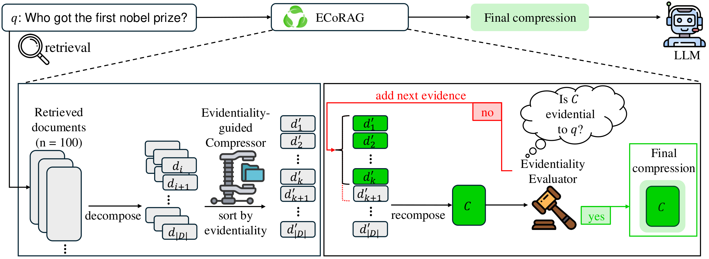

# ♻️ ECoRAG

**ECoRAG** (Evidentiality-guided Compression and Retrieval-Augmented Generation) compresses long retrieved contexts by *evidentiality* — whether a sentence actually supports generating the correct answer — and then reflects on the compression to decide how much evidence is enough.

[](https://aclanthology.org/2025.findings-acl.1365/)

## 🤔 What is ECoRAG?

RAG with many retrieved documents runs into two problems. Irrelevant text distracts the reader LLM, and existing compressors do not filter it out — a plain "prepend the top-100 documents" baseline beats them. And the right compression ratio differs per question: compress too much and the evidence is gone, too little and the context degrades generation.

ECoRAG addresses both with evidentiality, defined hierarchically over two conditions:

1. **Strong evidence** — without the sentence the LLM cannot produce the correct answer, but with it the LLM can.
2. **Weak evidence** — the sentence does not satisfy condition 1, but it does not interfere with the evidence that does. Sentences that do interfere are **distractors**.

<p align="center">
  
  <br>
  <em>The ECoRAG framework</em>
</p>

These labels drive two lightweight components:

1. **Evidentiality-guided compressor** (Contriever, 110M) — a dual encoder trained so that strong evidence outranks weak evidence, which outranks distractors. It decomposes the retrieved documents into sentences and sorts them into an ordered evidence list `d'_1, ..., d'_|D|`.

2. **Evidentiality evaluator** (Flan-T5-large, 770M) — the same labels distilled into a classifier that emits a single `<EVI>` / `<NOT>` token. **Evidentiality reflection** starts from `d'_1`, asks the evaluator whether the collective is evidential, and adds more evidence until it is (or a token limit is hit). The compression ratio therefore adapts per question.

Because the compressor scores sentences pointwise and the evaluator generates one token per iteration, compression stays fast enough to handle 100+ documents where LLM-based abstractive compressors do not.

## ⚙️ Setup

1. Install requirements:
```bash
pip install -r requirements.txt
python -c "import nltk; nltk.download('punkt')"
```

2. Prepare the retrieval results.

ECoRAG assumes the retrieved documents are given (improving the retriever is out of scope). Put the DPR top-100 output for your task under `data/labeler/<task>/`, as `train.json` and `test.json`:

```json
[
  {
    "question": "who got the first nobel prize in physics",
    "answers": ["Wilhelm Conrad Röntgen"],
    "ctxs": [
      {"id": "wiki:645586", "title": "Henri Becquerel", "text": "...", "score": "82.73882"}
    ]
  }
]
```

3. Set up your OpenAI API key (only needed for the GPT reader in step 4):
```bash
export OPENAI_API_KEY=your_api_key_here
```

## 🚀 Quick Start

The four stages run in order. Every script takes the task name as its first argument (`NQ`, `TQA`, `WQ`, ...) and defaults to `NQ`.

### 1. Evidentiality labeling

Mines the evidentiality labels with the reader LLM (Flan-UL2). This is the expensive stage — it needs one LLM call per candidate sentence — but the labels are reused by both the compressor and the evaluator.

```bash
cd labeler

# decompose the retrieved documents into sentences
sh 1_split_into_sentences.sh NQ

# condition 1: closed-book run + one-sentence-at-a-time run
sh 2_mine_strong_evidentiality.sh NQ 8      # 8 = number of GPUs to shard across

# bundle each candidate with distractors from the same question
sh 3_build_weak_input.sh NQ

# condition 2: does the sentence interfere with the evidence?
sh 4_mine_weak_evidentiality.sh NQ 8

# assemble strong / weak / distractor into the compressor's training data
sh 5_build_compressor_data.sh NQ
```

Produces `data/compressor/NQ/{train,dev}.json` with `positive_ctxs` (strong evidence), `hard_negative_ctxs` (weak evidence) and `negative_ctxs` (distractors), plus `data/compressor/NQ/test.json` — every sentence of the test set's retrieved documents.

### 2. Compressor training

```bash
cd compressor

# dual-encoder training: strong > weak > distractor
sh 1_train_compressor.sh NQ 15812           # 15812 steps for NQ, 5832 for TQA

# score every test sentence and sort by evidentiality
sh 2_run_compressor.sh NQ

# re-rank the labeled train/dev data with the trained compressor, for the evaluator
sh 3_score_labeled_data.sh NQ
```

Weak evidence is used as a hard negative at a 0.15 ratio, so the compressor learns to rank it above distractors but below strong evidence. Step 2 writes the ordered evidence to `data/evaluator/NQ/test.json`.

### 3. Evaluator training

```bash
cd evaluator

# distill the evidentiality labels into Flan-T5-large
sh 1_train_evaluator.sh NQ

# evidentiality reflection: grow the compression until it is evidential
sh 2_run_evaluator.sh NQ ../checkpoints/evaluator/NQ/checkpoint-46000
```

The reflection loop adds 4 sentences per iteration and stops after 5 iterations at the latest, matching the 20-sentence token limit used in the paper. The adaptive compression lands in `data/reader/NQ/test.json`.

### 4. Reader inference

```bash
cd reader

sh 1_qa_gpt.sh NQ     # GPT-4o-mini
sh 2_qa_ul2.sh NQ     # Flan-UL2
```

Reports Exact Match and writes per-example predictions to `reader/output/NQ/`.

## 📁 Repository structure

```
labeler/       [1] evidentiality mining with the reader LLM
compressor/    [2] evidentiality-guided compressor (Contriever)
evaluator/     [3] evidentiality evaluator + adaptive compression (Flan-T5-large)
reader/        [4] answer generation and EM evaluation
data/          inputs and intermediate files for each stage
checkpoints/   trained compressor and evaluator
```

Each stage reads what the previous stage wrote:

```
data/labeler/<task>/      retrieval output, sentences, mined LLM signals
      ↓
data/compressor/<task>/   train/dev with evidentiality labels, test sentences
      ↓
data/evaluator/<task>/    train/dev re-ranked by the compressor, sorted test evidence
      ↓
data/reader/<task>/       the final compression
```

## 📝 Citation

If you find our work useful, please consider citing our paper:
```bibtex
@inproceedings{jeong2025ecorag,
    title={Ecorag: Evidentiality-guided compression for long context rag},
    author={Jeong, Yeonseok and Kim, Jinsu and Lee, Dohyeon and Hwang, Seung-won},
    booktitle={Findings of the Association for Computational Linguistics: ACL 2025},
    pages={26607--26628},
    year={2025}
}
```

## Acknowledgments

This work was supported by the National Research Foundation of Korea(NRF) grant funded by the Korea government(MSIT) (No. RS-2024-00414981), Institute of Information & communications Technology Planning & Evaluation (IITP) grant funded by the Korea government (MSIT) (No. 2022-0-00077/RS-2022-II220077, AI Technology Development for Commonsense Extraction, Reasoning, and Inference from Heterogeneous Data), and Institute of Information & communications Technology Planning & Evaluation (IITP) grant funded by the Korea government(MSIT) [NO.RS-2021-II211343, Artificial Intelligence Graduate School Program (Seoul National University)].
