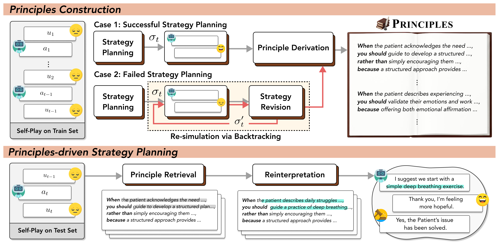

#  PRINCIPLES: Synthetic Strategy Memory for Proactive Dialogue Agents
🏆 Accepted at **EMNLP 2025 Findings**

[](https://arxiv.org/abs/2509.17459)
[](https://huggingface.co/datasets/LangAGI-Lab/P4GPlus)
[](https://huggingface.co/spaces/kimnamssya/Principles)
---

## Overview


- we propose PRINCIPLES: a synthetic strategy memory for proactive dialogue agents.
- PRINCIPLES is derived through offline self-play simulations and serves as reusable knowledge that guides strategy planning during inference, eliminating the need for additional training and data annotation.
- We evaluate PRINCIPLES in both emotional supporting and persuasion domains, demonstrating its consistent improvements over strong baselines. 
- Furthermore, PRINCIPLES maintains its robustness across extended and more diverse evaluation settings.

---

## Running PRINCIPLES

You can run PRINCIPLES in two phases:

### Phase I: Principles Construction

First, set `MODE="train"` in `scripts/run_ours.sh` and run:

```
bash scripts/run_ours.sh
```


### Phase II: Principles-driven Strategy Planning


Set `MODE="test"` in `scripts/run_ours.sh` and run:

```
bash scripts/run_ours.sh
```

---

<!-- ## Citation
```
@inproceedings{ong2025towards,
  title={Towards Lifelong Dialogue Agents via Timeline-based Memory Management},
  author={Ong, Kai Tzu-iunn and Kim, Namyoung and Gwak, Minju and Chae, Hyungjoo and Kwon, Taeyoon and Jo, Yohan and Hwang, Seung-won and Lee, Dongha and Yeo, Jinyoung},
  booktitle={Proceedings of the 2025 Conference of the Nations of the Americas Chapter of the Association for Computational Linguistics: Human Language Technologies (Volume 1: Long Papers)},
  pages={8631--8661},
  year={2025}
}
``` -->